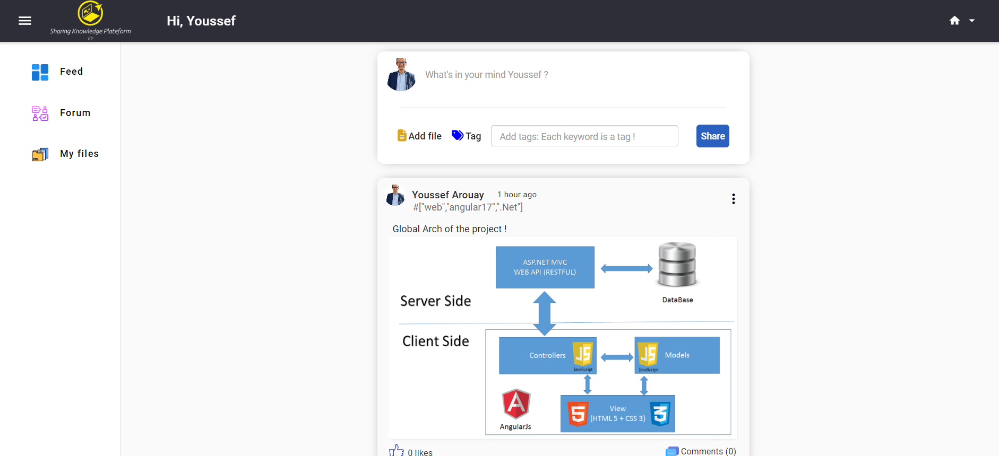
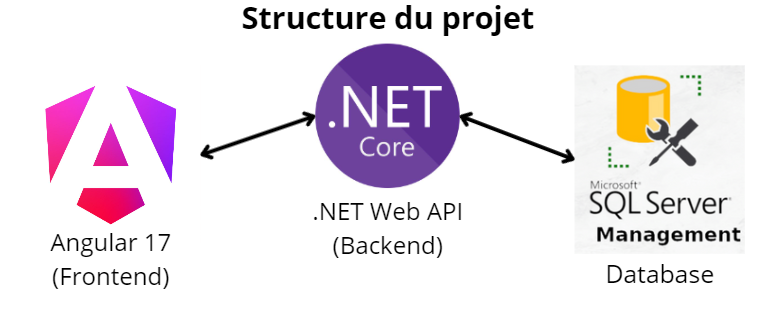
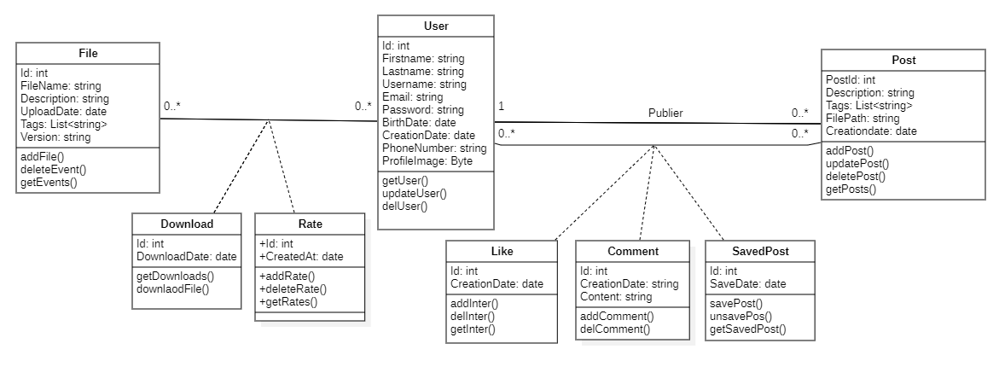
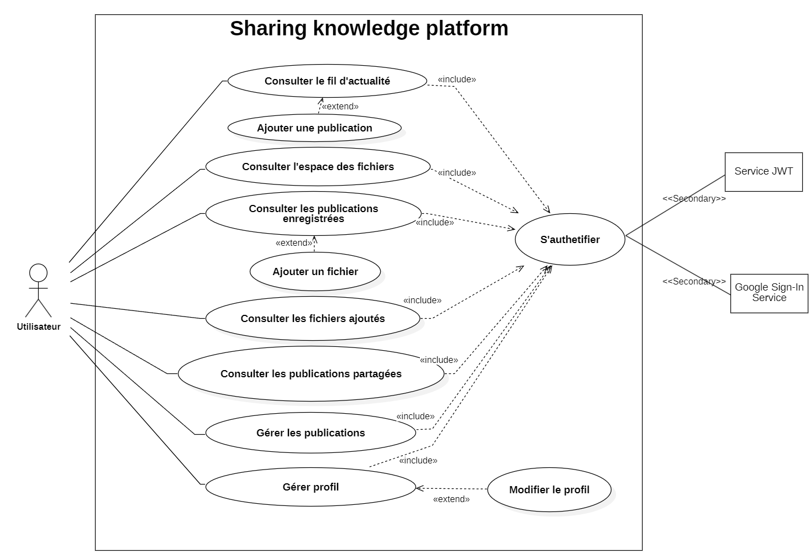
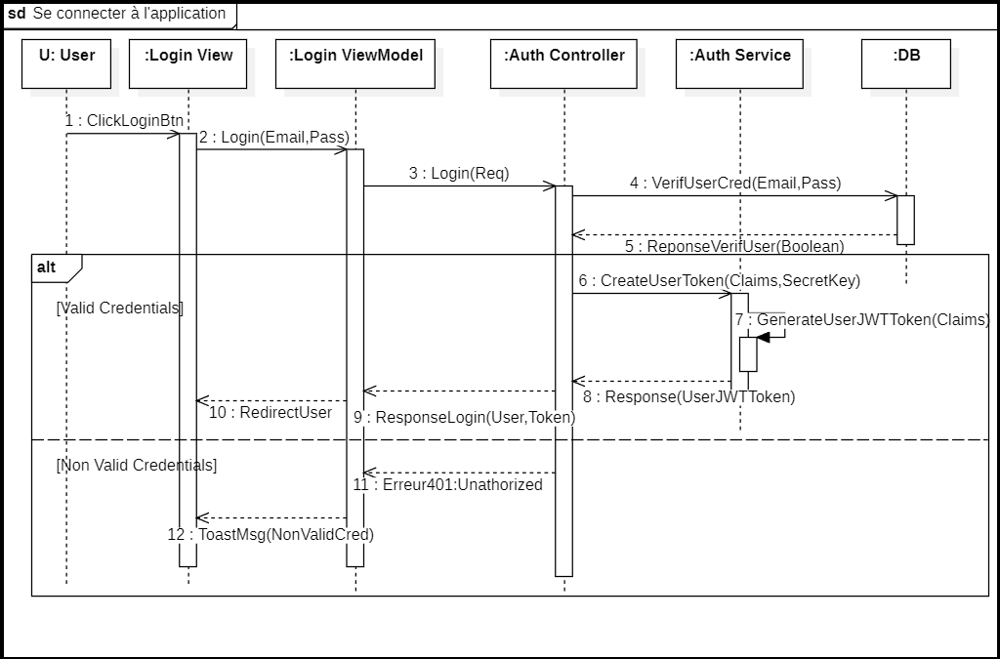
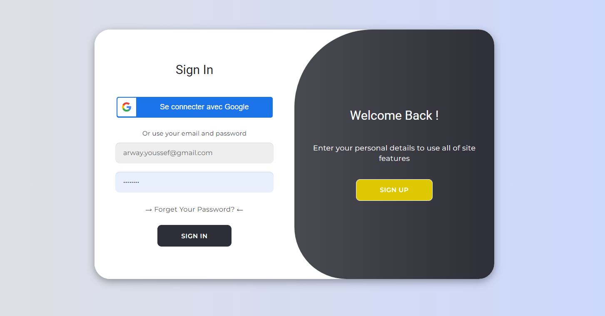
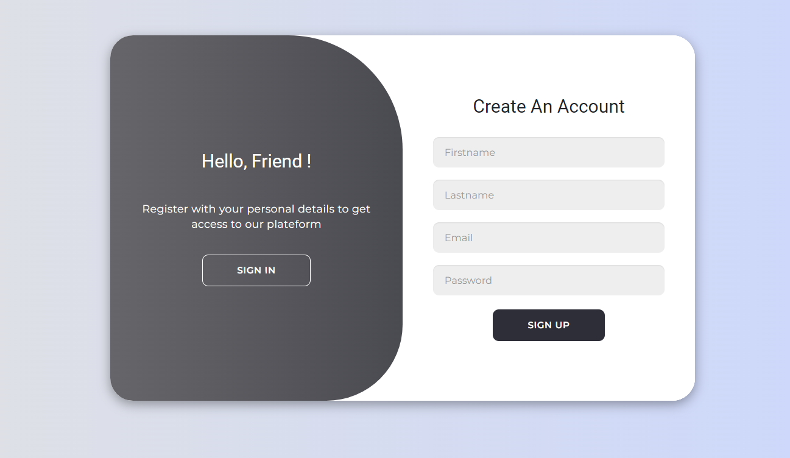
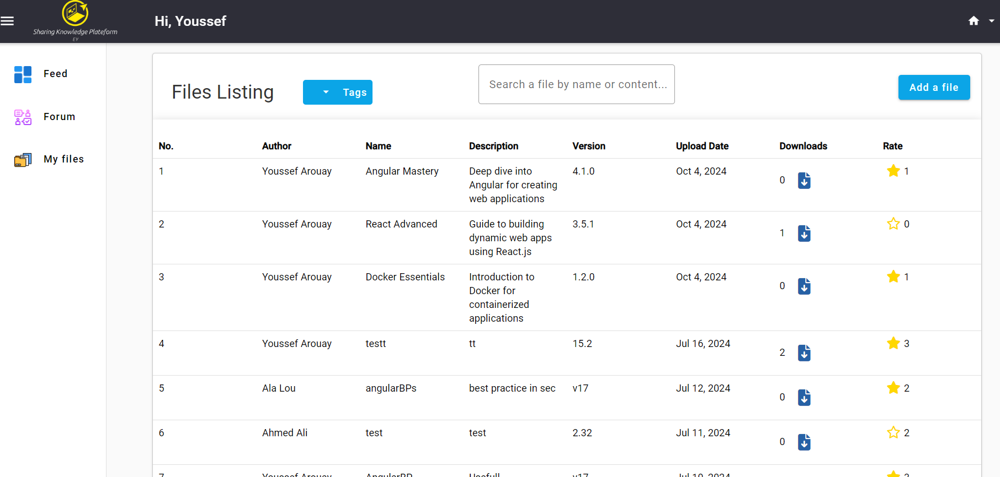
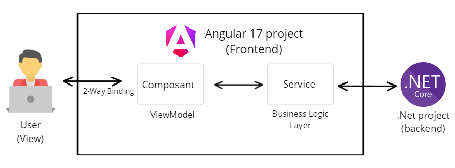
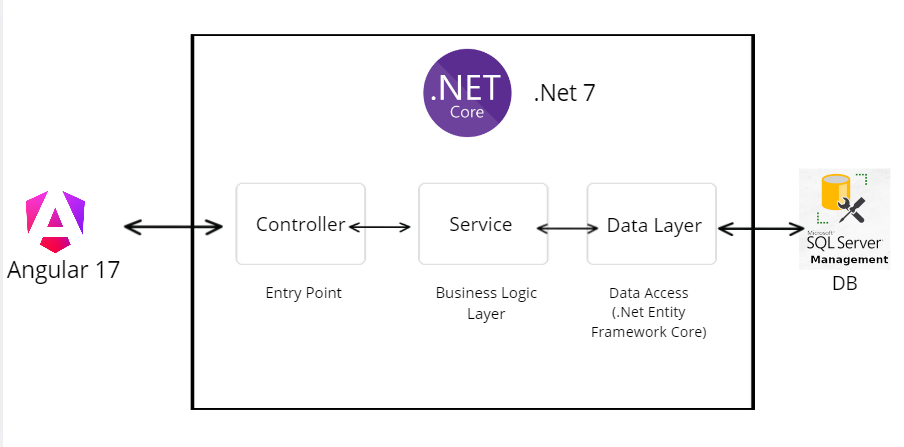

# Knowledge sharing platform



## Overview

### 1. Project structure


This project is a web application built using the following stack:
- **Frontend**: Angular 17
- **Backend**: .NET 7
- **Database**: Microsoft SQL Server

The application includes features such as file and posts sharng & management, tagging, and forums of files, as showcased in the screenshots below.

---

## Features
- **User Authentication**: Secure login and registration.
- **File Management**: Upload, download, and categorize files with tags.
- **Discussion Forums**: Share posts and collaborate with others.
- **Responsive Design**: Optimized for desktop and mobile users.

---

## Installation

### Prerequisites
- Node.js (for Angular)
- .NET SDK (v7)
- SQL Server (local or remote)

### Steps
1. Clone the repository:
   ```bash
   git clone https://github.com/Youssef-Arouay/Internal-Knowledge-Sharing-Platform
   cd Internal-Knowledge-Sharing-Platform
2. Install dependencies for Angular and run frontend:
    ```bash
    cd frontend
    npm install
    ng s -o
4. Restore .NET dependencies and run backend:
   ```bash
   cd ../Backend
   dotnet restore
   dotnet run

## UML

### 1. Classes diagram





## Screenshots

### 1. Auth



### 2. File Listing Page


---
### Frontend Structure


### Backend Structure


 

